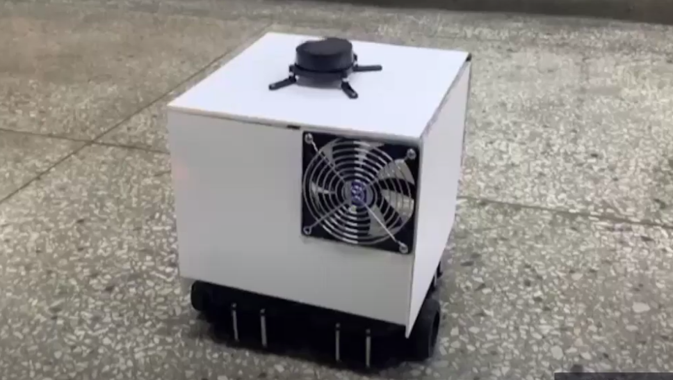
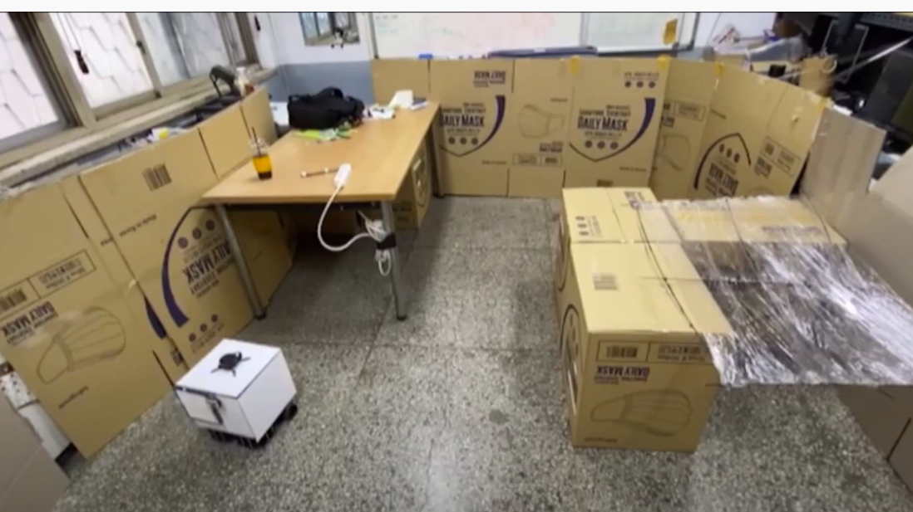

# airmate(for melodic)

## Purpose
 기존의 공기청정기는 하나의 방에 하나씩 배치하는 방식이었기 때문에 공간이 넓어질수록 더많은 청정기 구매를 필요로 한다. 우리는 하나의 공기청정기가 여러 구역을 목표 지점으로 삼아 스스로 순회하면서 청정을 수행할 수 있는 자율주행 공기청정기 'airmate'를 구상하였다. airmate는 ROS기반의 시스템을 사용하여 로봇에 부착된 센서들을 효율적으로 통신, 제어 할 수 있다. 또한 사용자는 airmate_app을 통해 로봇이 바라보는 화면과 실내공간에 대한 로봇의 위치를 시각화 할 수 있고, 로봇의 동작에 대한 제어 명령을 내릴 수 있다. airamte paackage는 'dust_densitiy' topic에 대한 publish와 subscribe에 대한 동작을 수행할 수 있고, airmate_nvigation package는 사용자가 입력한 위치에 대한 순차 순회를 가능하게 해준다.





## Environment
- ubuntu : 18.04
- ROS : melodic
- python : 2.7

## Install
#### install ros(melodeic)
```
# install ros-melodic from ros.org
sudo apt-get update
```
#### install wstool and rosdep
```
sudo apt-get install -y python-wstool python-rosdep ninja-build stow
```

## PC setup
#### make workspace
```
mkdir -p catkin_ws/src
```

#### install dependent pacakges for Turtlebot3 control on remote PC
```
cd catkin_ws/src
git clone https://github.com/ROBOTIS-GIT/turtlebot3_msgs.git
git clone -b melodic-devel https://github.com/ROBOTIS-GIT/turtlebot3.git
```
#### install cartorgapher
```
cd catkin_ws
wstool init src
wstool merge -t src https://raw.githubusercontent.com/cartographer-project/cartographer_ros/master/cartographer_ros.rosinstall
wstool update -t src

# install cartographer_ros dependencies
rosdep update
rosdep install --from-paths src --ignore-src --rosdistro=${ROS_DISTRO} -y

# install abseill-cpp library for cartographer
src/cartographer/scripts/install_abseil.sh
```
#### install airamte_navigation
```
mv [airmate_navigation_kg] path/to/yout_ws
```
#### build and install
```
catkin_make_isolated --install --use-ninja
```

## Usage
#### start master node
```
roscore
```
#### run cartographer
```
roslaunch turtlebot3_slam turtlebot3_slam.launch slam_methods:=cartographer configuration_basename:=turtlebot3_lds_2d_gazebo.lua
#if you executing cartographer on real environment, change the configuration_basename to :=turtlebot3_lds_2d.lua)
```

#### run airmate_navigation
```
rosrun airmate_navigation airmate_navigation.py

# create waypoints
Use RViz’s "2D Pose Estimate" tool to create waypoints with mouse clicks.
Or use application's '이동정화 모드'

# executing '이동정화 모드'
rostopic pub /path_ready std_msgs/Empty -1

# to clear waypoint queue
rostopic pub /path_reset std_msgs/Empty -1
```

### Reference
- Indrotuction youtube : https://youtu.be/Nz0BxnbTmKo

